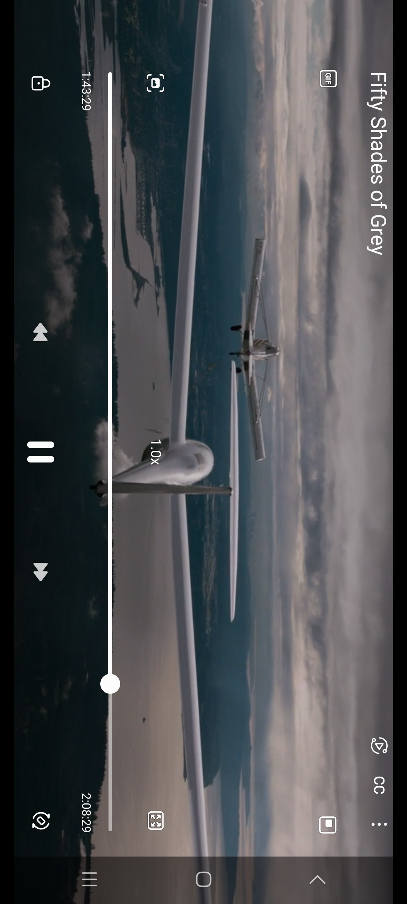

# Share-Now
An android file sharing app over local network

## Screenshots

## Notes
The app was build focusing on functionality. App permissions are naively implemented. So, it might not work with newer android versions.

